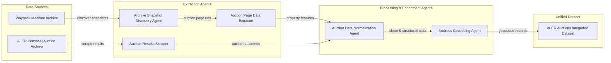

# System Architecture

The ALER Auction extraction system is a multi-agent pipeline designed to integrate historical property characteristics with post-auction results.

## Data Pipeline

## Orchestration Logic

1. **Discovery**: `WaybackDiscoveryAgent` uses `WaybackClient` to find snapshots map to auction listings.
2. **Extraction**: `AuctionExtractionAgent` parses HTML tables or PDFs found in snapshots to extract `lot_id` and structural traits.
3. **Results**: `AuctionResultsAgent` scrapes the live ALER historical site for final prices and results.
4. **Normalization**: `AuctionNormalizationAgent` standardizes currency, dates, and property codes in PDF results.
5. **Integration**: `DatasetIntegrationAgent` performs the final join on `lot_id` between property features and PDF results, generating `consolidated_auction_dataset`.
6. **Geocoding**: `GeocodingAgent` adds spatial context to the consolidated dataset.