# System Architecture

The ALER Auction extraction system is a multi-agent pipeline designed to integrate historical property characteristics with post-auction results.

## Data Pipeline

```mermaid
graph LR

%% --------------------
%% DATA SOURCES
%% --------------------
subgraph DATA_SOURCES["Data Sources"]
    A[Wayback Machine Archive]
    B[ALER Historical Auction Archive]
end

%% --------------------
%% EXTRACTION AGENTS
%% --------------------
subgraph EXTRACTION_AGENTS["Extraction Agents"]
    C[Wayback Discovery Agent]
    D[Auction Extraction Agent]
    E[Auction Results Agent]
end

%% --------------------
%% PROCESSING AGENTS
%% --------------------
subgraph PROCESSING_AGENTS["Processing & Enrichment Agents"]
    F[Dataset Integration Agent]
    G[Geocoding Agent]
    H[Price Analysis Agent]
end

%% --------------------
%% FINAL DATASET
%% --------------------
subgraph DATASET["Unified Dataset"]
    I[ALER Auctions Integrated Dataset]
end

%% FLOW
A -->|discover snapshots| C
C -->|auction page urls| D
D -->|property features| F

B -->|scrape results| E
E -->|auction outcomes| F

F -->|join property & results| G
G -->|geocoded coordinates| H
H -->|price clusters & metrics| I
```

## Orchestration Logic

1. **Discovery**: `Wayback Discovery Agent` uses `WaybackClient` to find snapshots mapping to auction listings.
2. **Extraction**: `Auction Extraction Agent` uses `AuctionExtractor` to parse HTML tables found in snapshots to extract `lot_id` and structural traits.
3. **Results**: `Auction Results Agent` uses `HistoricalAuctionClient` and `PDFExtractor` to scrape and parse ALER historical PDFs for outcomes.
4. **Integration**: `Dataset Integration Agent` uses `DatasetIntegrator` to merge property traits and auction results.
5. **Geocoding**: `Geocoding Agent` uses `Geocoder` to add spatial coordinates to the consolidated dataset.
6. **Analysis**: `Price Analysis Agent` uses `PriceAnalyzer` to calculate price disparities and spatial clusters, producing the final enhanced dataset.